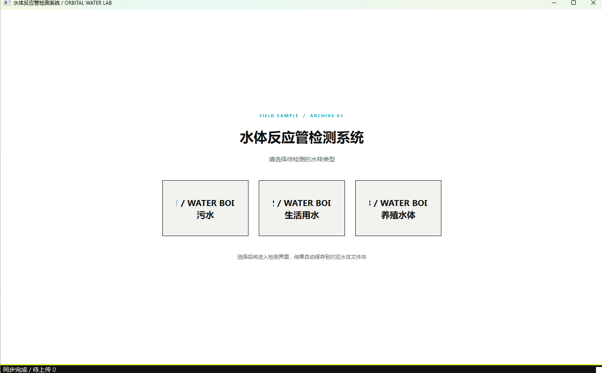
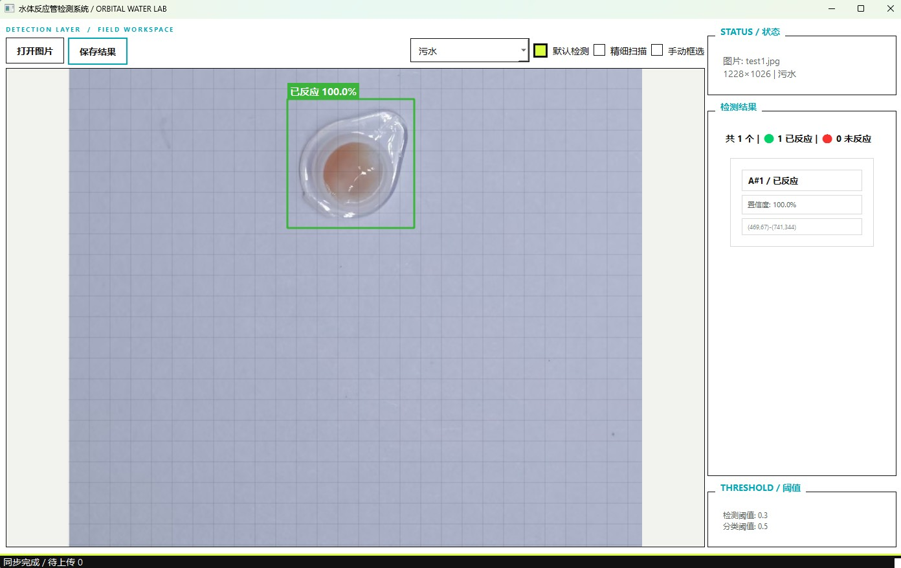
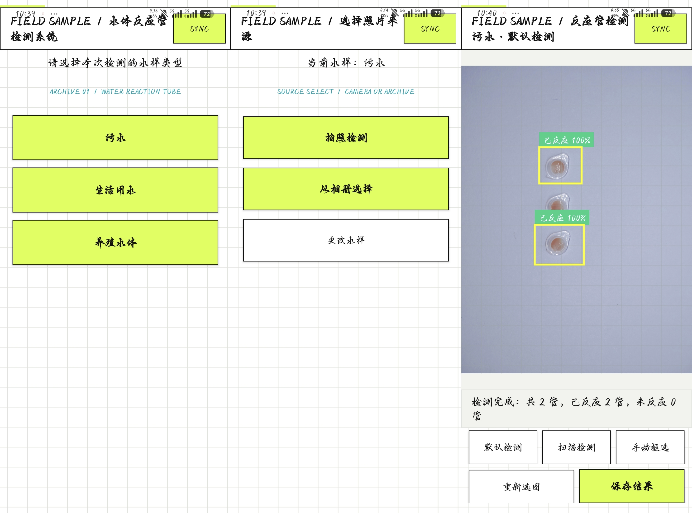

# 水体反应管检测系统

  

面向水样反应管照片的离线辅助识别工具，支持 Windows 桌面端和 Android 手机端。

> **English:** An offline-assisted water-reaction-tube detection tool for Windows and Android. It helps users inspect reaction-tube photos, review results, and optionally synchronize confirmed records.

检测结果用于技术辅助和人工复核，不能替代实验室检测、监管结论或其他专业判断。

## 产品展示

### Windows 主界面

  

### 检测结果

  

### Android 使用流程

  

### 操作演示视频

点击下方截图打开约 43 秒的完整演示视频：

  

> 展示素材使用演示数据制作；实际上传照片前，请确认其中不含个人隐私。
## 核心功能

- **Windows 桌面检测**：支持 Windows x64 便携运行，适合批量查看和复核水样照片。
- **Android 移动检测**：支持 Android 14/API 34 及以上设备，可拍照或从相册选择照片。
- **离线模型识别**：正式客户端内置检测模型，常规识别不要求实时联网。
- **多种检测方式**：根据照片情况使用默认检测、精细扫描或手动框选。
- **结果保存与复核**：查看识别框、标签和置信度后再保存结果。
- **可选同步**：联网后可按需上传检测结果；离线状态下仍可先完成本地检测和保存。
- **发布与统计服务**：服务器提供版本下载、客户端发布管理和检测结果统计接口。

## 基本使用流程

1. 准备清晰、光线均匀的反应管照片，并确认照片中不含个人隐私。
2. 选择水样类型，再选择拍照或从相册导入照片。
3. 运行默认检测；照片较大、目标较小或背景复杂时，可使用精细扫描或手动框选。
4. 检查识别框、标签和置信度，必要时重新拍摄或人工复核。
5. 保存结果；联网时再根据需要上传同步。

## 下载与安装

### 官网直下

- [Windows 便携 ZIP](https://hiddenmoon.duckdns.org/downloads/desktop)
- [Android APK](https://hiddenmoon.duckdns.org/downloads/mobile)
- [官网首页](https://hiddenmoon.duckdns.org/)

### GitHub Release

前往 [v1.0.5 Release](https://github.com/hiddenmoon-dusk/water-reaction-detection/releases/tag/v1.0.5) 获取：

- Windows 便携完整包 `water-detection-desktop-v1.0.5-win64.zip`
- Windows 主程序 `water-detection-desktop-v1.0.5.exe`
- Android 安装包 `water-reaction-android-v1.0.5.apk`
- Android App Bundle `water-reaction-android-v1.0.5.aab`
- 中文使用说明和统一 `SHA256SUMS.txt`

### Windows

1. 下载并解压完整 ZIP 到本地目录。
2. 双击目录中的 `水体反应管检测系统.exe`。
3. 不要只复制 EXE；必须保留同目录的 `_internal`、模型文件和 `release.json`。
4. 当前 Windows 包未使用 Authenticode 代码签名，首次运行可能出现 SmartScreen“未知发布者”提示。

### Android

1. 设备需要 Android 14/API 34 或更高版本。
2. 下载 APK 并按系统提示完成安装。
3. 首次使用时按需授予相机和照片选择权限。
4. AAB 主要用于后续应用商店发布流程，不能像 APK 一样直接安装。

下载后请使用 Release 中的 `SHA256SUMS.txt` 校验文件完整性。

## 版本与兼容性

| 平台 | 当前发布 | 要求 | 分发形式 |
| --- | --- | --- | --- |
| Windows | v1.0.5 | Windows x64 | 便携 ZIP，内含 EXE、模型和运行库 |
| Android | v1.0.5 / versionCode 6 | Android 14/API 34+ | APK 直接安装，AAB 用于商店流程 |
| 官网服务 | HTTPS | 需要网络的同步和下载功能 | `https://hiddenmoon.duckdns.org` |

## 隐私、安全与准确性

检测结果和图片会一同上传到服务器。服务器数据通常仅保存一天，主要用于优化识别模型以及相关检测结果的统计。

上传前请自行确认照片中不含身份证件、面部、住址、联系方式或其他个人隐私。系统不会因为照片中包含隐私而自动替你完成脱敏。

如需申请删除与你有关的数据，请发送邮件至 [sunx77@mail2.sysu.edu.cn](mailto:sunx77@mail2.sysu.edu.cn)，并尽量提供上传时间、结果标识或其他可定位信息。完整内容请阅读[用户隐私政策](https://hiddenmoon.duckdns.org/privacy)和[用户协议](https://hiddenmoon.duckdns.org/terms)。

检测结果是技术辅助信息，不能替代实验室检测、人工复核、医疗判断、监管结论或其他高风险决策依据。

## 已知限制

- Windows v1.0.5 当前为未签名便携包，没有 Inno Setup 安装器；首次运行可能被 Windows SmartScreen 标记为未知发布者。
- Windows ZIP 内的 EXE 必须与 `_internal`、`reaction_classifier.h5`、`yolov8n.pt` 和 `release.json` 保持目录结构。
- 照片质量、光照、遮挡和反应管状态都会影响识别效果；重要场景请进行人工复核或实验室复检。
- 真实 Android 设备、干净 Windows 环境、第三方许可证逐项核对和应用商店材料属于后续发布工作。

## English summary

Water Reaction Tube Detection is an offline-assisted image recognition tool for reaction-tube photos. It provides Windows and Android clients, local result review, and optional server synchronization when the user chooses to upload.

The current release is v1.0.5. Android requires API 34 or newer. The Windows package is portable and unsigned, so users should download the complete ZIP and keep the executable, runtime directory, model files, and release metadata together.

## 从源码构建

展开 Android / Windows 构建说明

### Android 正式构建

Android 正式包必须使用仓库外的签名配置和正式 keystore，不能把密码或 keystore 提交到 Git：

~~~powershell
cd android-app
Copy-Item .\release-signing.properties.example .\release-signing.properties
# 在本机编辑 release-signing.properties，不要提交 Git
$env:WATER_PUBLIC_BASE_URL = 'https://your-domain.example'
$env:WATER_BOOTSTRAP_TOKEN = '在本机输入的发布 Token'
.\scripts\build-formal-release.ps1
~~~

### Windows 正式构建

~~~powershell
$env:WATER_PUBLIC_BASE_URL = 'https://your-domain.example'
$env:WATER_BOOTSTRAP_TOKEN = '在本机输入的发布 Token'
.\scripts\build-windows-formal-release.ps1
~~~

正式构建脚本会在缺少签名配置、模型资产、HTTPS 地址或必要工具时失败，不会把 Debug 包或未配置服务器的包标记为正式发布。

## 项目结构

展开目录说明

~~~text
android-app/       Android 客户端和正式签名/构建脚本
model-tools/       模型转换与一致性检查工具
server/            Flask/Gunicorn 结果与发布服务器
packaging/windows/ Inno Setup 安装包模板
scripts/           Windows 正式发布和验证脚本
docs/              设计、运维和中文使用文档
assets/branding/   Android、Windows、官网共用的应用图标源和 PNG
~~~

## 安全边界

请勿提交以下内容：

- Android keystore、PFX/PEM 私钥、签名密码或其他访问凭据。
- 服务器 SSH 私钥、管理员密码、Secret Key、bootstrap Token 和数据库。
- 用户原始照片、检测结果、上传归档、备份、日志和构建缓存。
- 未经许可证核对的模型权重、训练数据、字体或第三方依赖副本。

## 许可证与第三方依赖

当前仓库未在 README 中声明统一的项目开源许可证。若要进一步分发源代码、模型或训练数据，请先根据实际版本补充 `LICENSE`、`NOTICE` 及第三方许可文本，并确认模型权重和训练数据具有可分发授权。

## 反馈与支持

隐私删除申请、使用反馈和问题报告请联系 [sunx77@mail2.sysu.edu.cn](mailto:sunx77@mail2.sysu.edu.cn)。
